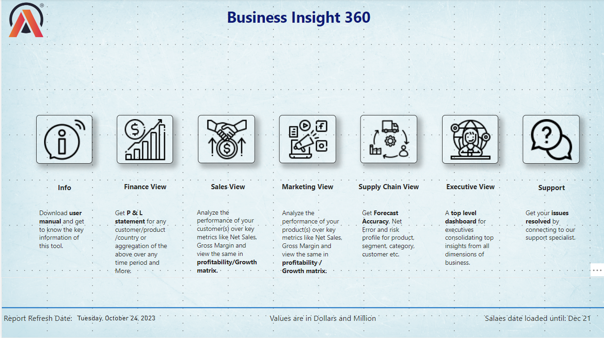

# 🏭 AtliQ Hardware Business Intelligence Dashboard

This project presents a dynamic and interactive Power BI dashboard built for **AtliQ Hardware**, a global company specializing in the sales of computers and computer accessories. The dashboard aims to provide data-driven insights for multiple departments across the organization, helping the business make smarter, faster decisions.

🔗 [LinkedIn Post](https://www.linkedin.com/feed/update/urn:li:activity:7123534203882803200/)  
📊 [View Live Dashboard](https://app.powerbi.com/view?r=eyJrIjoiZGQ5NmVmMWEtMmE0MS00MDA0LThkZGUtNGNkMWZlYTMxMzJlIiwidCI6ImM2ZTU0OWIzLTVmNDUtNDAzMi1hYWU5LWQ0MjQ0ZGM1YjJjNCJ9&pageName=ReportSection9b7d6c3c34b1c7da6cc1)

---

## 🏢 About the Company

**AtliQ Hardware** is a rapidly growing global business that sells computers and computer accessories through three primary channels:

- 🛒 **Retailers**  
- 📦 **Distributors**  
- 🔗 **Direct Sales**

Despite its international expansion, the company faced a major setback after launching stores in the United States based on intuition, limited surveys, and basic Excel analysis. Competitors, equipped with strong analytics teams, were making far more informed decisions.

As a result, AtliQ Hardware decided to invest in building a dedicated **analytics team** to adopt a data-driven decision-making approach and maintain competitiveness in the hardware market.

---

## ❗ Problem Statement

Due to lack of advanced data analytics capabilities, AtliQ Hardware suffered a significant loss in its US market expansion. The leadership team realized that **relying on intuition and spreadsheets was no longer viable** in a competitive, data-driven industry.

**The objective of this project** was to:

- Build a centralized and interactive analytics dashboard using Power BI  
- Provide detailed, role-specific insights for departments including Sales, Finance, Marketing, Supply Chain, and Executives  
- Empower the company to make **smarter, faster, and data-backed decisions**

---

## 🧠 Power BI Techniques Learned

Through this project, I strengthened my understanding of core and advanced Power BI concepts:

- ✅ Data validation techniques  
- 📅 Development of date tables using **M Language**  
- 🔗 Snowflake-style **Data Modeling**  
- 🧮 Creating **Calculated Columns** and **Measures** using DAX  
- 📝 **Dynamic Titles** based on applied filters  
- 🔄 Bookmarking to **switch between visuals**  
- 🎨 **Conditional Formatting** with icons and background color  
- 🔘 Page navigation using **buttons**  
- ☁️ Publishing reports to **Power BI Service**

---

## 🧰 Tools & Technologies

- **Power BI Desktop**
- **Power BI Service**
- **DAX & M Language**
- **MySQL** (as data source)
- **DAX Studio**
- **Excel** (for pre-validation)

---

## 🧭 Step-by-Step Process

### 1️⃣ Importing Data into Power BI
- Connected to a **MySQL database** by providing credentials
- Imported all necessary tables for building the report

### 2️⃣ Data Modeling
- Employed a **Snowflake Schema** for a well-structured data model
- Established proper relationships between fact and dimension tables
- Created **Date Table** using M Language for time-based analysis

### 3️⃣ Dashboard Design & Development
- Used provided mock-ups as a visual reference
- Created calculated columns and DAX measures as required
- Designed department-specific views to serve:
  - Finance
  - Sales
  - Marketing
  - Supply Chain
  - Executives

### 4️⃣ Power BI Features Implemented
- Navigation between pages using buttons
- Applied dynamic filtering, conditional formatting, and bookmarks
- Added a support page for help resources
- Published and shared via **Power BI Service**

---

## 📸 Dashboard Preview

> *A snapshot of the AtliQ Hardware Power BI Dashboard*

---

## 📎 Useful Links

- 🔗 [LinkedIn Project Post](https://www.linkedin.com/feed/update/urn:li:activity:7123534203882803200/)
- 📊 [Live Dashboard on Power BI](https://app.powerbi.com/view?r=eyJrIjoiZGQ5NmVmMWEtMmE0MS00MDA0LThkZGUtNGNkMWZlYTMxMzJlIiwidCI6ImM2ZTU0OWIzLTVmNDUtNDAzMi1hYWU5LWQ0MjQ0ZGM1YjJjNCJ9&pageName=ReportSection9b7d6c3c34b1c7da6cc1)

---

## 🙌 Acknowledgement

This project was completed as a part of my advanced data analytics journey — combining technology, business acumen, and storytelling through visuals.  
Feel free to connect on [LinkedIn](https://www.linkedin.com/in/dashimel/) for collaboration or discussion.

---

